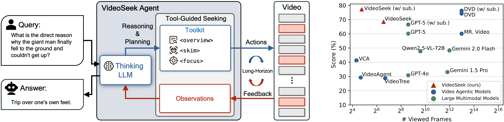
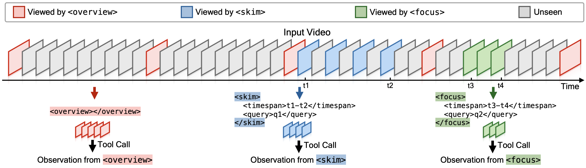

# VideoSeek: Long-Horizon Video Agent with Tool-Guided Seeking

[](https://arxiv.org/abs/2603.20185)
[](https://opensource.org/licenses/MIT)

<div>
  <a href="https://jylin.me/">Jingyang Lin</a><sup>1,2</sup>,
  <a href="https://jialianwu.com/">Jialian Wu</a><sup>1</sup>,
  <a href="https://joellliu.github.io/">Jiang Liu</a><sup>1</sup>,
  <a href="https://cs-people.bu.edu/sunxm/">Ximeng Sun</a><sup>1</sup>,
  <a href="https://zewang95.github.io/">Ze Wang</a><sup>1</sup>,
  <a href="https://www.xiaodongyu.me/">Xiaodong Yu</a><sup>1</sup>,
  <a href="https://www.cs.rochester.edu/u/jluo/">Jiebo Luo</a><sup>2</sup>,
  <a href="https://zicliu.wixsite.com/mysite">Zicheng Liu</a><sup>1</sup>,
  <a href="https://scholar.google.com/citations?user=bX1YILcAAAAJ">Emad Barsoum</a><sup>1</sup>
  <br>
  <sup>1</sup>AMD&emsp; 
  <sup>2</sup>University of Rochester&emsp; 
</div>

This repository contains the official implementation of the [VideoSeek](https://arxiv.org/abs/2603.20185) agent.

## Introduction

VideoSeek is a long-horizon video agent that leverages video logic flow to actively seek answer-critical evidence instead of exhaustively parsing the full video.


VideoSeek (w/ subtitles) achieves the best performance while processing only about 1/300 as many frames as the second-best video agent.

Toolkit of the VideoSeek agent, including `<overview>`, `<skim>`, and `<focus>` tools:


- `<overview>`: rapidly scans the entire video to build a coarse storyline and highlight promising intervals. 
- `<skim>`: takes a quick glance at these candidate intervals at low cost to check whether query-relevant evidence is nearby.
- `<focus>`: zooms in on a fine-grained clip with dense inspection to obtain answer-critical observations.


## Installation

1. Create a conda virtual environment and activate it:

```bash
conda create -n videoseek python==3.13
conda activate videoseek
```

2. Clone the repository:

```bash
git clone https://github.com/jylins/videoseek
cd videoseek
```

3. Install the package:

```bash
pip install -e .
```

Notes:

- **`ffmpeg` is required**.

## Usage

### CLI

Please execute `videoseek-cli -h` for help:
```
usage: videoseek [-h] --video_path VIDEO_PATH --user_query USER_QUERY [--subtitle_path SUBTITLE_PATH] [--output_dir OUTPUT_DIR] [--verbose] [--model_name MODEL_NAME] [--api_base API_BASE] [--api_key API_KEY] [--api_version API_VERSION]
                 [--reasoning_effort REASONING_EFFORT] [--seed SEED] [--temperature TEMPERATURE] [--max_tokens MAX_TOKENS] [--max_steps MAX_STEPS]

options:
  -h, --help            show this help message and exit
  --video_path VIDEO_PATH
                        YouTube URL or local path to video.
  --user_query USER_QUERY
                        Question/query towards this video.
  --subtitle_path SUBTITLE_PATH
                        Local path to subtitle file.
  --output_dir OUTPUT_DIR
                        Directory to write outputs (default: ./output/).
  --verbose             Print agent step logs.
  --model_name MODEL_NAME
                        Model name.
  --api_base API_BASE   API base.
  --api_key API_KEY     API key.
  --api_version API_VERSION
                        API version.
  --reasoning_effort REASONING_EFFORT
                        Reasoning effort of the LLM.
  --seed SEED           Seed.
  --temperature TEMPERATURE
                        Temperature.
  --max_tokens MAX_TOKENS
                        Max output tokens of the LLM.
  --max_steps MAX_STEPS
                        Max steps of the VideoSeek agent.
```


Run with a local video:

```bash
# Example from LVBench (qid: 3094)
videoseek-cli \
    --video_path ./wgBlACG927Y.mp4 \
    --subtitle_path ./wgBlACG927Y.srt \
    --user_query "What animal statue is under the Dong Men Ding Food Street sign?\n(A) Hawk\n(B) Panda\n(C) Tiger\n(D) Lion\nPlease directly answer with the best option's letter from the given choices directly (A, B, C, or D)." \
    --verbose
```

Outputs are written under `output/<VIDEO_ID>_<timestamp>/`:

- `prediction.json`
- `trajectory.json`

## Citation

If you find our work useful, please consider citing:

```bibtex
@article{lin2026videoseek,
  title={VideoSeek: Long-Horizon Video Agent with Tool-Guided Seeking},
  author={Lin, Jingyang and Wu, Jialian and Liu, Jiang and Sun, Ximeng and Wang, Ze and Yu, Xiaodong and Luo, Jiebo and Liu, Zicheng and Barsoum, Emad},
  journal={arXiv preprint arXiv:2603.20185},
  year={2026}
}
```